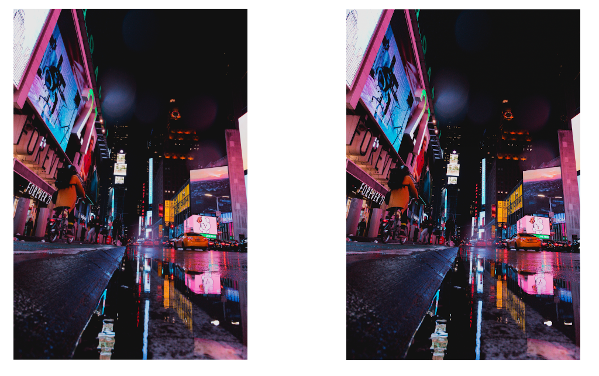

# Stegtool: A simple example of Steganography using Python

## What is Steganography

[Steganography](https://en.wikipedia.org/wiki/Steganography) defines the practice of concealing a message within another message or a physical object. From a digital point of view, this can be implemented by embedding some hidden content inside a file, without causing the file to change drastically.

One of the simplest techniques to achieve that involves the usage of **pictures**, and it's the one that I've implemented in these simple scripts. 

### LSB Technique 

In order to hide the content inside a picture, I used a technique known as **LSB Technique**, where LSB stands for "Least Significant Bit". A complete explanation can be found in [this article](https://www.ijltet.org/wp-content/uploads/2015/02/60.pdf), but here's how it works quickly.

The main content of a, for example, PNG file includes color information for each pixel of the image file. More specifically, 24 bits are used to store the Red, Green and Blue components (8 bits each) of every single pixel. This means, for example, that if we have a `1920x1080` image file, this will contain `2073600` pixels that will be stored as 3 sequences of 8 bit each. So, at the end, we'll have `6220800` bytes.

If we change, for each byte, the *Least Significant Beat* (so, the last one of the 8-bit sequence) the image will change only slightly and in an almost imperceptible way. This means that, if we store each bit of our hidden content by changing the LSB of every byte of the image, we'll be able to hide some data in it that we'll retrieve in a second step.

If our image contains `6220800` bytes as before, we'll be able to store a single bit inside every byte, so we'll have room for `6220800` bits, or `777600` bytes.

If I want to store the bit sequence `001111`, I'll use two pixels as follows:

|**Pixel**| **Color** | **Original Color Value** | **Next bit** | **Final Color Value** |
|-|-|-|-|-|
|1|Red|`10011010`|`0`|`10011010`|
|1|Green|`00110111`|`0`|`00110110`|
|1|Blue|`01111001`|`1`|`01111001`|
|2|Red|`01110111`|`1`|`01110111`|
|2|Green|`00111000`|`1`|`00111001`|
|2|Blue|`11001111`|`1`|`11001111`|

### How images change

Here's an example of how an image changes after another file is embedded using the LSB technique: 

As you can see, the difference is so minimal that I can't personally notice any change. The right image, though, embeds another gif image inside itself.

### Considerations

The LSB technique is pretty easy to implement, even though it is overall easy to detect compared to more sophisticated techinques in Steganography. It's, by the way, a great starting point to approach these world and I'm happy to share what I've learned.

Usually image files will also contain additional informations at the beginning of the file, those are not supposed to be changed in order to preserve the integrity of the file. It's not a big deal if you're using a library for image manipulation, because it will handle all the additional contents for you, but keep in mind that, if you're planning to work without libraries, you'll have to take care of that.

> The image above is Royalty Free and was downloaded from [Pexels](https://www.pexels.com/)

## Usage

The repository contains the following files:

- `stegaencode.py` (which is the script that embeds files inside a picture)
- `stegadecode.py` (which is the script that extract files from a previosly manipulated picture)
- `example` (directory which contains different files that can be used for testing purposes)
- `requirements.txt` (which lists the dependencies in order to be able to run the scripts)

## Requirements

I suggest you to create and activate a Python Virtual Environment (`python3 -m venv myenv`) and activate it.
After doing that, clone the repository and run `pip install -r requirements.txt` in order to install [**Pillow**](https://pypi.org/project/Pillow/) and [**bitarray**](https://pypi.org/project/bitarray/) which are the only two dependencies. The first one, is a well-known image manipulation library and the second one allows to obtain arrays of single bits from bytes, which will be useful while encoding and decoding the hidden content.

### Running the script

Once you've installed the requirements you can try to embed something! On this purpose, I've included a HQ image file which you can find at `example/image.jpg` and a variety of regular files (mp3, txt, zip and so on) that you can try to embed according to your preferences (The mp3 file is a sexy a beat I made 🥰).

---

In order to **embed** a file inside the image you can run:

`python3 stegaencode.py [/path/to/picture] [/path/to/hidden/file]`

For example, I'll run

`python3 stegaencode.py example/image.jpg example/secret.mp3`

This will output a new **PNG** file (`embedded.png`) that will embed the secret file.

---

In order to **extract** the hidden file you can run:

`python3 stegadecode.py [/path/to/new/picture]`

For example, I'll run

`python3 stegadecode.py embedded.png`

This will output the hidden file (`out.extension`) in the actual folder. 

---

#### Why PNG?  

The `embedded.png` file will always be encoded as **PNG** because lossy encoding might compromise the hidden information.

### How is the file stored inside the image

The script's behaviour is pretty simple: given a path to an image and to a file it will find out:

- File extension (with its length)
- File content (with its length).

It will, then, build a byte string containing: 

|Extension Length [n]|Extension|Content Length [m]|Content|
|-|-|-|-|
|4 bytes|`n` bytes|4 bytes|`m` bytes|

It will, then, check if the image is able to include the given information. If that happens, the script will scan every pixel of the image and substitute the **LSB** according to the next bit of the content.

### How is the file retrieved from the image

The decoding script retrieves all the LSB from each pixel of the image and then reads the file extension and content by knowing their length value. The file will be built as follows: 

- Firstly, four bytes are read as the length of the extension (`n`)
- Then, `n` bytes are read and converted to string
- Then, other 4 bytes are read as the length of the content (`m`)
- Then, `m` bytes are read and written to a file with the given extension

At the end, you'll find a file named `out` in your PWD which will be the file retrieved from the image. 

## Conclusions

As stated previously, this content doesn't aim to implement complex steganography techniques. Instead, it proposes and explains an easy-to-follow implemention in order to experiment with what's happening behind the curtains while applying these kind of strategies. Feel free to fork and do whatever you want with the code!

